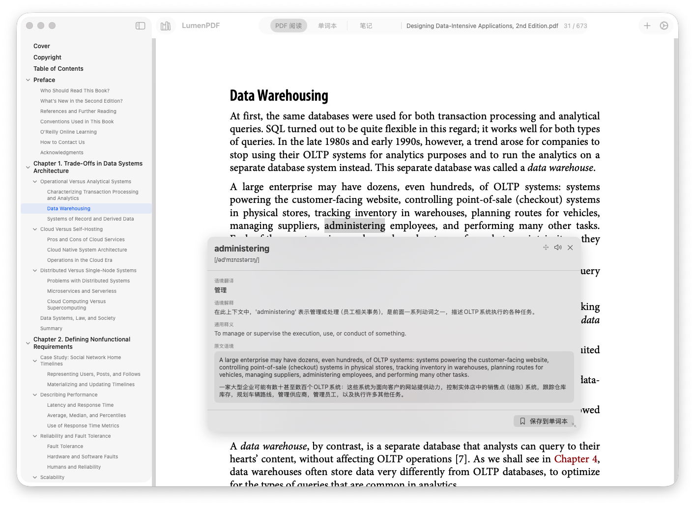
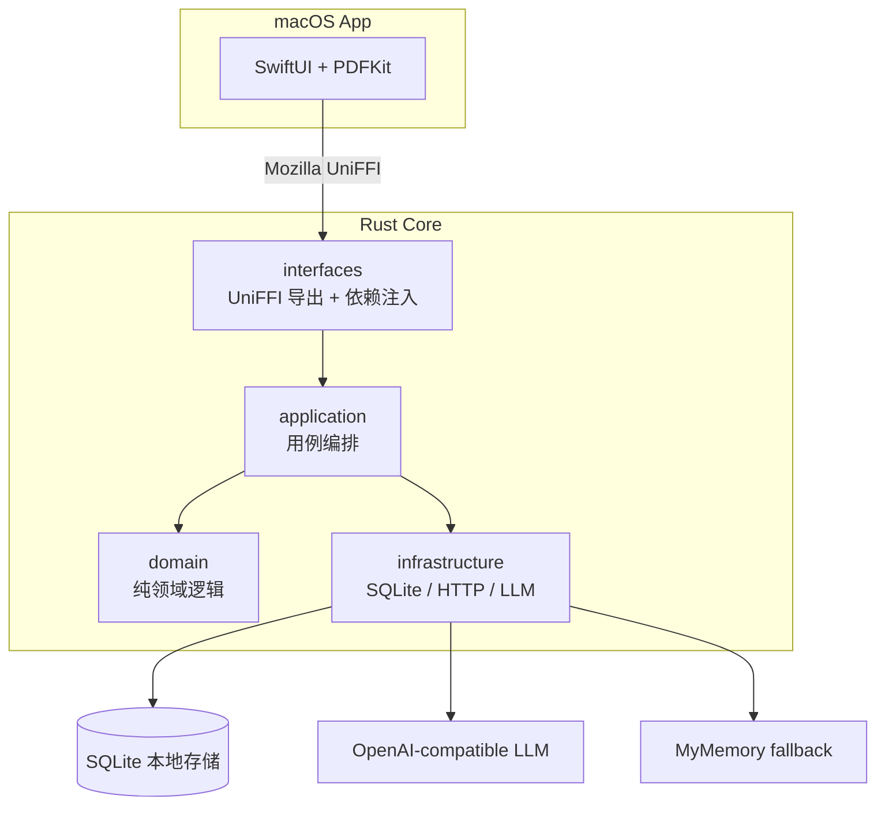

# LumenPDF

<p align="center">
  
</p>

LumenPDF 是一款面向深度阅读的 macOS PDF 阅读器。它保留系统 Preview 式的轻量阅读体验，同时把翻译、划线笔记、单词本和本地知识沉淀放在同一个工作流里。


<p align="center">
  
</p>

## 特性

- 阅读 PDF：连续滚动、目录跳转、自动恢复上次阅读位置。
- 看懂英文论文和技术书：划选单词或句子后，得到带上下文的中文解释。
- 边读边沉淀：把单词保存到单词本，把句子解释保存成笔记。
- 标注原文：高亮和下划线写入 PDF 标注，重启后仍能恢复。
- 保持数据本地：笔记、单词、阅读进度存在本机 SQLite；API Key 存在 macOS Keychain。

## 安装

### 下载 DMG

如果 GitHub Releases 中已经提供 DMG，下载最新版，打开后把 `LumenPDF.app` 拖到 `Applications`。

首次打开如果 macOS 提示“无法验证开发者”，在 Finder 中右键点击 `LumenPDF.app`，选择“打开”，再在弹窗里确认一次即可。

### 从源码打包

适合开发者，或当前还没有预编译 DMG 时使用。

```bash
git clone https://github.com/hedon954/lumen-pdf.git
cd lumen-pdf

brew install xcodegen
rustup target add aarch64-apple-darwin x86_64-apple-darwin

make dmg
```

产物会生成在 `build/LumenPDF-<version>.dmg`。

如果你只是想把当前构建安装到本机：

```bash
make upgrade
```

它会先打包，再终止正在运行的 LumenPDF，并替换 `/Applications/LumenPDF.app`。

## 首次设置

打开 App 后，点击右上角设置按钮，填写一个 OpenAI 兼容接口：

| 配置项 | 说明 |
| --- | --- |
| API Base URL | 例如 `https://api.openai.com/v1`，也可以使用兼容 OpenAI API 的服务 |
| API Key | 存入 macOS Keychain，不写入明文配置文件 |
| 模型 | 任意兼容 Chat Completions 的模型 |
| 目标语言 | 默认简体中文 |

不配置 LLM 也能使用基础翻译，应用会降级到 MyMemory 免费 API；但上下文解释、长句分析和更自然的笔记体验需要 LLM。

## 常用操作

### 打开和阅读 PDF

点击工具栏中的文库按钮打开 PDF。LumenPDF 会记录阅读位置，下次打开自动回到上次阅读处。包含目录的 PDF 会在左侧显示大纲，点击章节即可跳转。

### 翻译单词或句子

在 PDF 中划选文本，点击浮动菜单里的“翻译”：

- 选中单词时，会显示音标、词性、上下文释义、例句位置和原句译文。
- 选中句子时，会直接解释这句话在当前上下文中的含义。
- 翻译结果可以保存到单词本或笔记。

### 高亮和划线笔记

划选文本后可以直接高亮，或创建划线笔记。笔记和标注会保存在本地；删除笔记时，对应的划线标注也会同步移除。

### 管理单词和笔记

切换到“单词本”或“笔记”页，可以搜索、编辑、删除已有内容，也可以跳回原 PDF 位置继续阅读。

## 开发

### 环境要求

- macOS 15+
- Xcode 16+
- Rust stable
- Homebrew

### 常用命令

```bash
make setup        # 首次安装工具并生成工程
make build-rust   # 构建 Rust 后端并生成 UniFFI Swift 绑定
make gen-project  # 根据 project.yml 重新生成 Xcode 工程
make test         # 运行 Rust 单元测试
make dmg          # 打包 DMG
make upgrade      # 打包并安装到本机 /Applications
```

也可以直接用 Xcode 打开工程运行：

```bash
open LumenPDF/LumenPDF.xcodeproj
```

## 技术架构

LumenPDF 由 SwiftUI 前端和 Rust 后端组成，中间通过 Mozilla UniFFI 连接：



Rust 后端按 DDD 分层组织：

- `interfaces/`：UniFFI 导出和依赖注入
- `application/`：用例编排
- `domain/`：纯领域逻辑，不依赖 SQL 或 HTTP
- `infrastructure/`：SQLite、HTTP、LLM 和 fallback 实现

## 文档

- 最新 PRD：[docs/prd/prd-2026-06-25-v109.md](docs/prd/prd-2026-06-25-v109.md)
- 最新 TDD：[docs/tdd/tdd-2026-06-25-v109.md](docs/tdd/tdd-2026-06-25-v109.md)
- 历史产品和技术文档见 [docs/](docs/)

## 数据位置

| 数据 | 位置 |
| --- | --- |
| SQLite 数据库 | `~/Library/Application Support/LumenPDF/data.db` |
| API Key | macOS Keychain |
| 阅读状态 | `UserDefaults` |

## License

MIT
