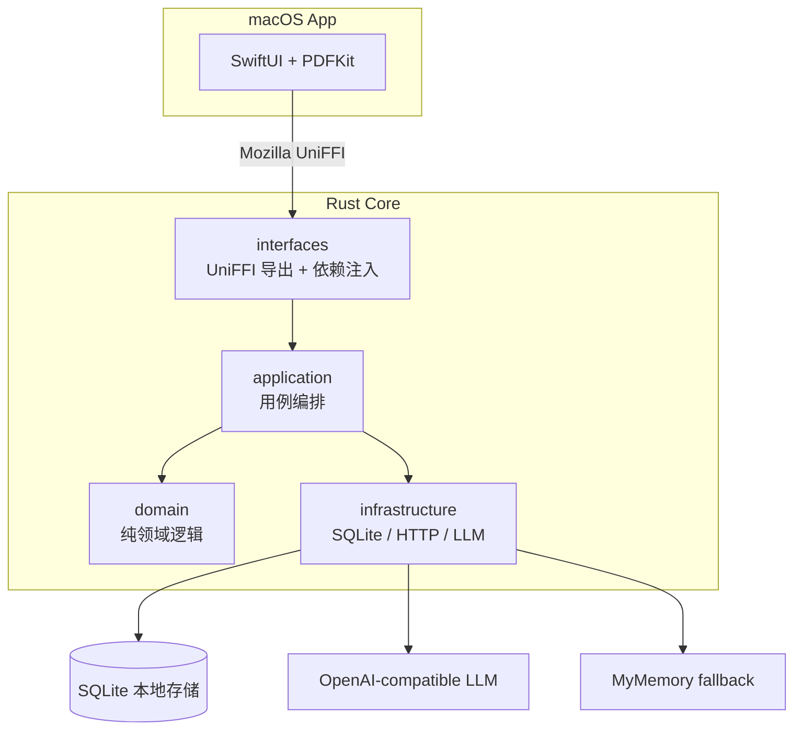

# LumenPDF

<p align="center">
  
</p>

LumenPDF 是一款面向深度阅读的 macOS PDF 阅读器。它保留系统 Preview 式的轻量阅读体验，同时把翻译、解释、划线笔记、单词本和本地知识沉淀放在同一个阅读工作流里。

适合阅读英文论文、技术书和长篇资料：你可以一边看 PDF，一边在右侧查看当前文档的单词与笔记，并随时跳回原文位置。


<p align="center">
  
</p>

## 特性

- **沉浸阅读**：连续滚动、目录跳转、自动恢复上次阅读位置。
- **上下文翻译**：划选单词或句子后，得到结合原文上下文的中文解释。
- **多轮提问式解释**：解释前可以输入自己的疑问；得到 AI 解释后还能在解释下方继续追问，自动带上前文上下文。
- **右侧阅读上下文栏**：在 PDF 旁边查看当前文档的单词和笔记；列表会跟随阅读位置，点击条目可跳回原文选区。
- **划线与笔记分离**：划线可直接落笔不打断阅读；需要沉淀想法时再创建笔记，同一处笔记可追加多条想法。
- **原生 PDF 标注**：高亮和下划线写入 PDF 标注，重启后仍能恢复。
- **本地优先**：笔记、单词、阅读进度存在本机 SQLite；API Key 存在 macOS Keychain。

## 安装

### 下载 DMG

如果 GitHub Releases 中已经提供 DMG，下载最新版，打开后把 `LumenPDF.app` 拖到 `Applications`。

如果首次打开时 macOS 提示“无法验证开发者”或“无法打开”，先尝试打开一次 `LumenPDF.app`，然后进入 **系统设置 → 隐私与安全性**，在“安全性”区域点击“仍要打开 / Open Anyway”，再在确认弹窗中选择“打开”。这个入口通常只会在尝试打开后的短时间内出现。参考：[Apple 官方说明](https://support.apple.com/guide/mac-help/open-a-mac-app-from-an-unknown-developer-mh40616/mac)。

### 从源码打包

适合开发者，或当前还没有预编译 DMG 时使用。

```bash
git clone https://github.com/hedon954/lumen-pdf.git
cd lumen-pdf

brew install xcodegen
rustup target add aarch64-apple-darwin x86_64-apple-darwin

make dmg
```

产物会生成在 `build/LumenPDF-<version>.dmg`。

如果你只是想把当前构建安装到本机：

```bash
make upgrade
```

它会先打包，再终止正在运行的 LumenPDF，并替换 `/Applications/LumenPDF.app`。

## 首次设置

打开 App 后，点击右上角设置按钮，填写一个 OpenAI 兼容接口：

| 配置项 | 说明 |
| --- | --- |
| API Base URL | 例如 `https://api.openai.com/v1`，也可以使用兼容 OpenAI API 的服务 |
| API Key | 存入 macOS Keychain，不写入明文配置文件 |
| 模型 | 任意兼容 Chat Completions 的模型 |
| 目标语言 | 默认简体中文 |

不配置 LLM 也能使用基础翻译，应用会降级到 MyMemory 免费 API；但上下文解释、长句分析和更自然的笔记体验需要 LLM。

## 常用操作

### 打开和阅读 PDF

点击工具栏中的文库按钮打开 PDF。LumenPDF 会记录阅读位置，下次打开自动回到上次阅读处。包含目录的 PDF 会在左侧显示大纲，点击章节即可跳转。

### 翻译单词或句子

在 PDF 中划选文本，点击浮动菜单里的“翻译”：

- 选中单词时，会显示音标、词性、上下文释义、例句位置和原句译文。
- 选中句子时，会直接解释这句话在当前上下文中的含义。
- 翻译结果可以保存到单词本或笔记。

### 提问式解释

在 PDF 中划选文本，点击浮动菜单里的“解释”：

- App 先展示解释输入框和原文，不会立即请求 LLM。
- 输入自己的问题后点击「解释」，模型会先回答问题，再从第一性原理展开。
- 不输入问题时，点击「直接解释」或按回车，会直接生成通用解释。
- 得到解释后，新的追问输入框会出现在解释下方，继续提问时会携带前文问答上下文。
- 较早的对话会被压缩成摘要，避免上下文无限增长。
- 当解释输入框或解释气泡获得键盘焦点时，回车都会提交当前解释动作。

### 高亮、划线和笔记

划选文本后可以直接高亮、划线，或创建带下划线的笔记：

- 点击「划线」会直接写入 PDF 下划线，不弹出输入框，适合快速标记。
- 点击「笔记」才会出现轻量输入框，可以写下自己的理解、疑问或总结。
- 笔记内容可以留空；留空时只保存笔记划线和原文。
- 如果再次完整选中已有笔记划线，会出现「添加笔记」入口，可以继续追加新的想法。
- 删除笔记时，对应的笔记划线标注也会同步移除。

### 右侧阅读上下文栏

阅读 PDF 时可以打开右侧栏，在同一个阅读界面中查看当前文档的「单词」或「笔记」：

- 右侧栏默认跟随 PDF 阅读位置滚动到附近条目。
- 手动滚动右侧栏到其他页码分组时，PDF 会同步跳转到对应页面。
- 点击单词或笔记卡片，会定位并短暂高亮原文选区。
- 打开或关闭右侧栏时，会尽量保留当前 PDF 页码和页内滚动位置，避免阅读进度回退。

### 管理单词和笔记

切换到“单词本”或“笔记”页，可以搜索、编辑、删除已有内容，也可以跳回原 PDF 位置继续阅读。笔记支持多条内容列表，适合对同一段原文逐步追加不同阶段的理解。

## 开发

### 环境要求

- macOS 15+
- Xcode 16+
- Rust stable
- Homebrew

### 常用命令

```bash
make setup        # 首次安装工具并生成工程
make build-rust   # 构建 Rust 后端并生成 UniFFI Swift 绑定
make gen-project  # 根据 project.yml 重新生成 Xcode 工程
make test         # 运行 Rust 单元测试
make dmg          # 打包 DMG
make upgrade      # 打包并安装到本机 /Applications
```

也可以直接用 Xcode 打开工程运行：

```bash
open LumenPDF/LumenPDF.xcodeproj
```

## 技术架构

LumenPDF 由 SwiftUI 前端和 Rust 后端组成，中间通过 Mozilla UniFFI 连接：



Rust 后端按 DDD 分层组织：

- `interfaces/`：UniFFI 导出和依赖注入
- `application/`：用例编排
- `domain/`：纯领域逻辑，不依赖 SQL 或 HTTP
- `infrastructure/`：SQLite、HTTP、LLM 和 fallback 实现

## 文档

- 最新 PRD：[docs/prd/prd-2026-07-02-reading-context-sidebar.md](docs/prd/prd-2026-07-02-reading-context-sidebar.md)
- 最新 TDD：[docs/tdd/tdd-2026-07-02-reading-context-sidebar.md](docs/tdd/tdd-2026-07-02-reading-context-sidebar.md)
- 历史产品和技术文档见 [docs/](docs/)

## 数据位置

| 数据 | 位置 |
| --- | --- |
| SQLite 数据库 | `~/Library/Application Support/LumenPDF/data.db` |
| API Key | macOS Keychain |
| 阅读状态 | `UserDefaults` |

## License

MIT
