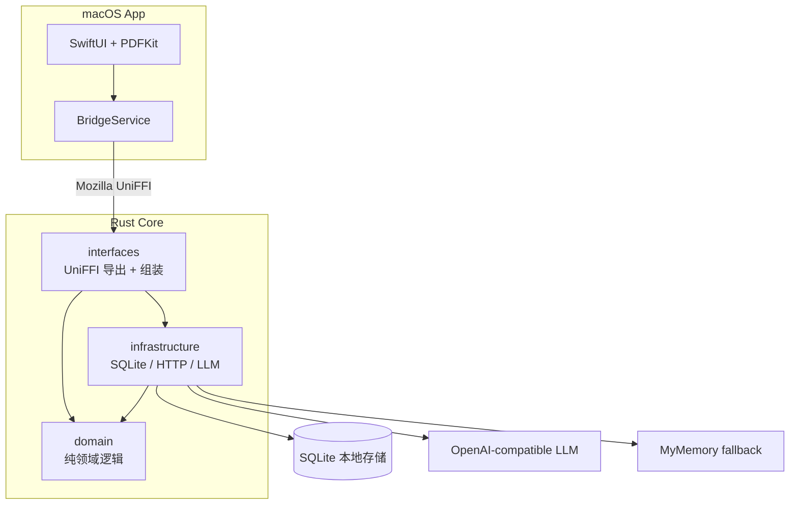

# LumenPDF

<p align="center">
  
</p>

LumenPDF 是一款面向深度阅读的 macOS PDF 阅读器。它保留系统 Preview 式的轻量阅读体验，同时把翻译、AI 导读、划线笔记、单词本和本地知识沉淀放在同一个阅读工作流里。

适合阅读英文论文、技术书和长篇资料：边读边翻译、追问、划线、记笔记，并随时回到原文位置。


<p align="center">
  
</p>

## 特性

- **PDF 阅读**：连续滚动、目录跳转、自动恢复阅读位置。
- **轻量翻译**：划选单词、短语或句子后快速查看上下文翻译。
- **Reading Inspector**：右侧 Inspector 集中显示上下文、AI 导读和笔记。
- **AI 导读**：围绕当前选区连续追问，支持 Markdown 回复和一键保存。
- **单词与笔记**：保存单词、划线、笔记和 AI 回复，沉淀当前文档的阅读上下文。
- **本地优先**：阅读进度、单词和笔记保存在本机，API Key 存入 macOS Keychain。

## 安装

### 下载 DMG

如果 GitHub Releases 中已经提供 DMG，下载最新版，打开后把 `LumenPDF.app` 拖到 `Applications`。

如果首次打开时 macOS 提示“无法验证开发者”或“无法打开”，先尝试打开一次 `LumenPDF.app`，然后进入 **系统设置 → 隐私与安全性**，在“安全性”区域点击“仍要打开 / Open Anyway”，再在确认弹窗中选择“打开”。这个入口通常只会在尝试打开后的短时间内出现。参考：[Apple 官方说明](https://support.apple.com/guide/mac-help/open-a-mac-app-from-an-unknown-developer-mh40616/mac)。

### 从源码打包

适合开发者，或当前还没有预编译 DMG 时使用。

```bash
git clone https://github.com/hedon954/lumen-pdf.git
cd lumen-pdf

brew install xcodegen
rustup target add aarch64-apple-darwin x86_64-apple-darwin

make dmg
```

产物会生成在 `build/LumenPDF-<version>.dmg`。

如果你只是想把当前构建安装到本机：

```bash
make upgrade
```

它会先打包，再终止正在运行的 LumenPDF，并替换 `/Applications/LumenPDF.app`。

## 首次设置

打开 App 后，点击右上角设置按钮，填写一个 OpenAI 兼容接口：

| 配置项 | 说明 |
| --- | --- |
| API Base URL | 例如 `https://api.openai.com/v1` 或 `https://api.deepseek.com/v1` |
| API Key | 存入 macOS Keychain，不写入明文配置文件 |
| 模型 | 任意兼容 Chat Completions 的模型 |
| 目标语言 | 默认简体中文 |

不配置 LLM 也能使用基础翻译；上下文解释和追问需要 LLM。

## 阅读工作流

打开 PDF 后，LumenPDF 会自动恢复上次阅读位置，并在左侧显示目录。划选文本后可以翻译、解释、划线或写笔记；「解释」会进入右侧 Reading Inspector，后续追问、AI 回复保存、上下文单词和笔记都在这里完成。切换到“单词本”或“笔记”页，可以集中搜索和管理已保存内容。

## 开发

### 环境要求

- macOS 15+
- Xcode 16+
- Rust stable
- Homebrew

### 常用命令

```bash
make setup        # 首次安装工具并生成工程
make build-rust   # 构建 Rust 后端并生成 UniFFI Swift 绑定
make gen-project  # 根据 project.yml 重新生成 Xcode 工程
make test         # 运行 Rust 单元测试
make dmg          # 使用稳定签名身份打包 DMG
make upgrade      # 打包并安装到本机 /Applications
```

`make dmg` / `make upgrade` 默认要求长期稳定的代码签名身份，避免二进制更新后反复触发 Keychain 授权。身份准备、CI secrets 和临时 ad-hoc 调试方式见 [代码签名与 Keychain 延续](docs/code-signing.md)。

也可以直接用 Xcode 打开工程运行：

```bash
open LumenPDF/LumenPDF.xcodeproj
```

## 技术架构

LumenPDF 由 SwiftUI 前端和 Rust 后端组成，中间通过 Mozilla UniFFI 连接：



- `interfaces/`：UniFFI 导出，组装 SQLite 与 LLM
- `domain/`：纯领域逻辑，不依赖 SQL 或 HTTP
- `infrastructure/`：SQLite、HTTP、LLM 和 fallback 实现

## 文档

- 当前主题头与配对表：[docs/README.md](docs/README.md)
- 签名与 Keychain：[docs/code-signing.md](docs/code-signing.md)

## 数据位置

| 数据 | 位置 |
| --- | --- |
| SQLite 数据库 | `~/Library/Application Support/LumenPDF/data.db` |
| API Key | macOS Keychain |
| 阅读状态 | `UserDefaults` |

## License

MIT
